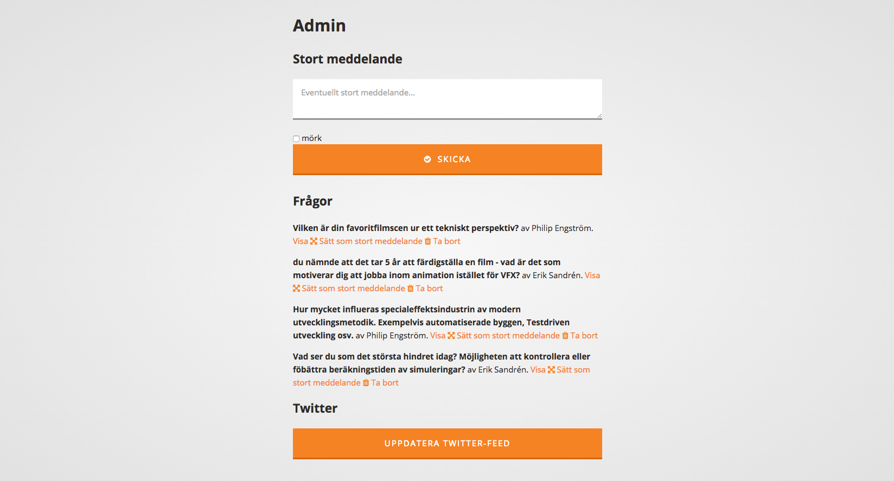
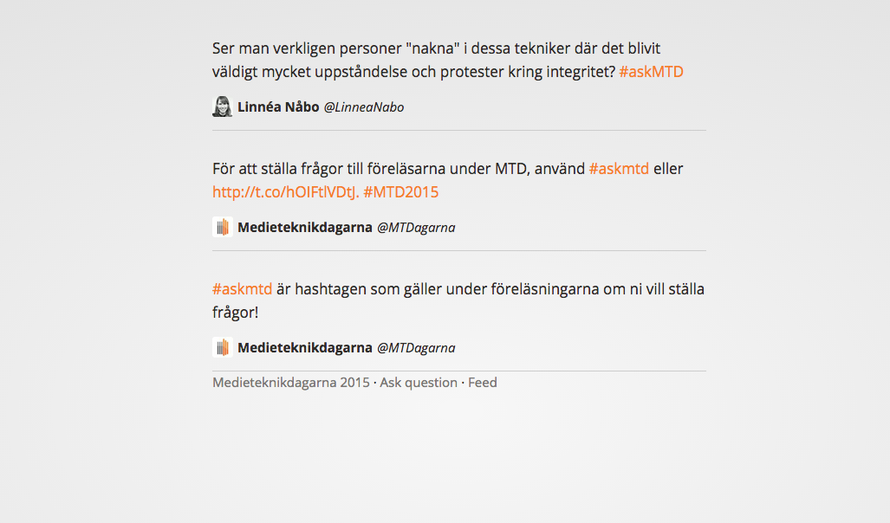
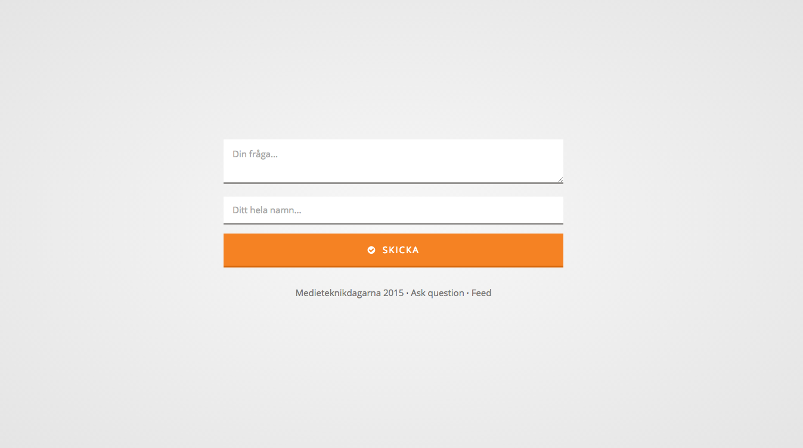

# MTD Live

This is a simple meteor application made for
[Medieteknikdagarna 2015](http://www.medieteknikdagarna.se) (The Media
Technology Days). It is used to give the lecture audience an easy way to ask the
lecturers questions.

The stylesheets are written in Stylus, and I've tried to apply BEM and namespaced
css as suggested in
[this article by Harry Roberts](http://csswizardry.com/2015/03/more-transparent-ui-code-with-namespaces/).

## Getting started

Download and install the application by running these commands:

```bash
git clone https://github.com/klaseskilson/mtd-live.git
cd mtd-live
meteor install
```

To get started, you need an Twitter application and its consumer and application
keys and secrets. You should then copy
[`private/conf.example.json`](private/conf.example.json) into `private/conf.json`
and enter the Twitter credentials there.

When Twitter is setup, start the application by running `meteor` in the
application's root folder.

### Deploy

Meteor is nice. It comes with built-in support for instant deployment. Simply
run

```bash
meteor deploy whatever-you-choose.meteor.com
```

and go to whatever-you-choose.meteor.com in you browser once it's done. I'd
recommend you change the super secure admin url in
[`lib/router.js`](lib/router.js) before deploying.

## Todo

The initial idea with this application was to provide the fair with a unified
social media stream. It later evolved into beeing a tool for the lecture host.
This todo list is not updated since.

* Add Instagram integration
* Make images appear nicely
* Make the twitter/instagram/whatever integration update automatically
* Move admin url config to config file

## Screenshots




